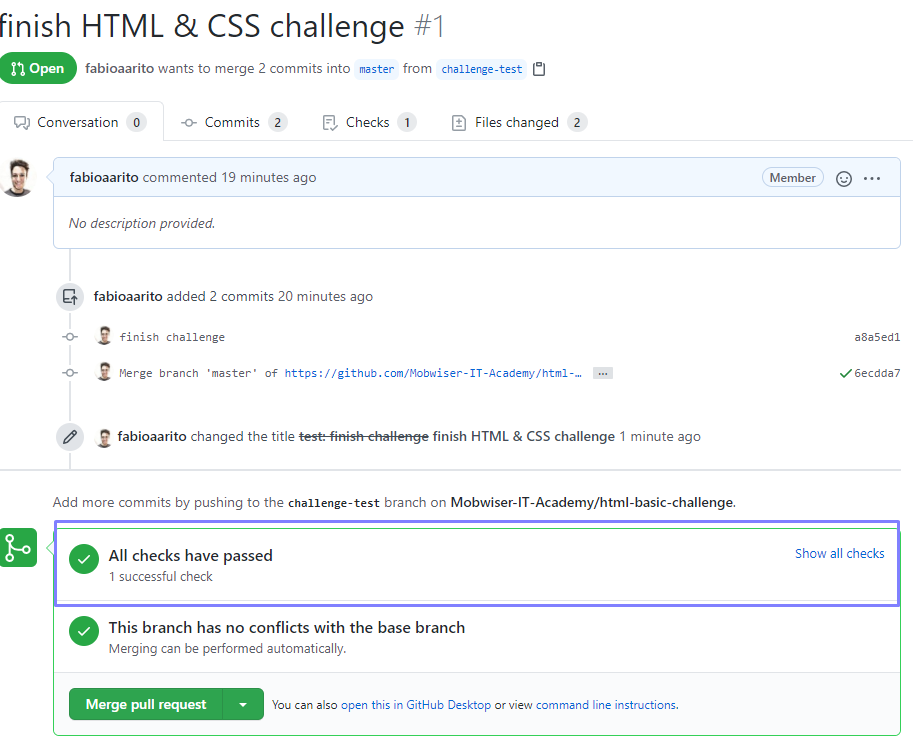

# html-basic-challenge

This repository was created so that you can test whether you already have the basics html & css skills.

Here you will create a simple resume website. So be creative a use this as your own portfolio.

## The challenge

Create a resume website with the following characteristics:

- A title (eg: My professional resume)
- Profile photo
- A list with your current technical skills
- A list with your soft skills
- A contacts section with you email, phone number and social media links

### Restrictions

- You have to include a heading tag (`<h1>`, `<h2>`, ..., `<h5>`)
- You have to include a `` tag
- You have to include a `<a>` with a link for your linkedin, instagram, facebook or twitter accounts

## How to do the challenge

1. Ask us to join the Mobwiser IT Academy Github organization - you just have to send us a message in our Discord community
1. Create a git branch called "challenge-<<your_name>>" (eg: challenge-fabio-rito)
1. Perform the changes in your own git branch
1. Create a pull request and you will receive automatic feedback whether you complete the challenge successfully.

**Note: Do you have any questions? Just ask us in our discord online community**

## FAQ

**How do I know my PR is valid?**

You have to ensure all checks have passed as showed in the image below.

